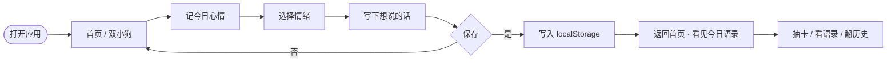

## 1. Product Overview

Maltese & Retriever 治愈手账 — 基于韩国流行的白色马尔济斯（Maltese）与暖金色小金毛（Golden Retriever）双 IP 形象，打造一款面向 18–35 岁都市年轻人的情绪舒缓 Web 应用。通过每日心情打卡、治愈语录、卡片收集与日记功能，让用户在忙碌中找到"和小狗一起慢下来"的治愈体验。

## 2. Core Features

### 2.2 Feature Module
1. **Home / 首页**：双小狗插画 Hero、当日心情入口、今日语录、快捷导航
2. **Mood / 心情日记**：心情选择（5 档情绪）、每日文字记录、历史时间线
3. **Quotes / 治愈语录**：马尔济斯语录 + 小金毛语录双列表、收藏切换、只看收藏模式
4. **Cards / 小狗卡片图鉴**：每日加权抽卡、5 张稀有度卡片（Maltese / Retriever 各有出场）、收集进度展示
5. **Settings / 设置**：本地数据管理、清除心情/语录/卡片、版本信息

### 2.3 Page Details
| Page Name | Module Name | Feature description |
|-----------|-------------|---------------------|
| Home | Dual Dog Hero | 马尔济斯在左、小金毛在右的联动插画，随当前心情改变动作与表情，悬浮/摇摆动画 |
| Home | Daily Quote | 按日期伪随机展示一条治愈语录，可跳转语录页 |
| Home | Quick Entry | 卡片收集进度、语录收藏进度，点击进入对应页面 |
| Mood | Mood Selector | 5 种情绪胶囊：开心/一般/疲惫/焦虑/难过，选择后小狗表情联动变化 |
| Mood | Daily Journal | 每日可写 200 字内的文字记录，同一天可覆盖更新 |
| Mood | History Timeline | 最近 30 天心情卡片时间线，显示当日情绪、语录和文字 |
| Quotes | Quote List | 区分 "马尔济斯说" 与 "小金毛说" 两套语录，独立收藏 |
| Cards | Daily Draw | 每天 1 次抽卡，含普通/稀有/珍贵 3 级稀有度，抽到后可在图鉴查看详情 |
| Cards | Collection | 5 张卡片图鉴，未抽到的显示灰色剪影 |
| Settings | Data Management | 分项清除心情 / 语录收藏 / 卡片图鉴 / 抽卡记录，或一键清空 |

## 3. Core Process

用户打开应用 → 首页看到两只小狗打招呼 → 点击"记一笔"→ 选择今日心情并写下几句话 → 保存后回到首页看到今日语录 → 可选抽一张当日卡片 / 浏览语录 / 查看历史 → 所有数据写入 localStorage。

## 4. User Interface Design

### 4.1 Design Style
- **主色调**：奶油米白 `#FFFAF0`、马尔济斯白 `#FFFFFF`、小金毛金 `#FFE4A8`、暖棕线条 `#4A3B2A`
- **辅助色**：淡粉 `#FFD9E0`、薄荷绿 `#C8E6D0`、浅紫 `#E8D9F0`
- **按钮**：超圆、3D 微凸起、按下时"弹一弹"；主按钮用暖黄渐变，幽灵按钮用白底描边
- **字体**：标题用圆润软手写感字体 `'Gaegu', 'Noto Sans KR', 'PingFang SC', sans-serif`；正文用 `'Noto Sans KR', 'PingFang SC', sans-serif`
- **布局**：卡片堆叠式 + 大量留白；圆角 `20px` 统一；柔和投影 `0 6px 22px rgba(74, 59, 42, 0.08)`
- **图标/插画**：纯 SVG 线条画；马尔济斯是白色圆毛团 + 黑色眼鼻线条；小金毛是蓬松金色毛发 + 圆润微笑嘴；所有小狗都有"抖尾巴 / 眨眼睛 / 上下浮动"微动画
- **动效**：页面入场渐显 + 轻微上浮；卡片 hover 时轻轻抬起 + 阴影加深；小狗尾巴轻摇循环动画；心情选择胶囊点击时轻微"踩下"再弹起

### 4.2 Page Design Overview
| Page Name | Module Name | UI Elements |
|-----------|-------------|-------------|
| Home | Dual Dog Hero | 两只小狗对称排布，中心对话气泡；奶油色径向渐变背景；浮动动画 |
| Home | Daily Mood Card | 左侧情绪 emoji、右侧"还没记录 / 已记录为 XX"、右侧跳转按钮 |
| Home | Quote Card | 大引号包裹语录 + 标签「马尔济斯说 / 小金毛说」+ 收藏按钮 |
| Mood | Mood Grid | 5 个彩色胶囊：开心(粉黄)/一般(米白)/疲惫(浅紫)/焦虑(浅蓝)/难过(灰) |
| Mood | Journal Box | 米黄圆角文本框，200 字计数，右下角"记一笔"主按钮 |
| Mood | Timeline | 竖直时间线，每日一行卡片，左侧情绪 emoji，右侧文字与日期 |
| Quotes | Quote Tabs | 顶部 Tab 切换「全部 / 马尔济斯 / 小金毛」；右上"只看收藏"按钮 |
| Cards | Draw Area | 居中大按钮"抽今天的一张"；上方一只闭眼等待的小狗；抽中后卡片翻转放大入场 |
| Cards | Grid | 2 列卡片网格；每张卡片展示小狗肖像、稀有度角标；未收集显示灰色剪影 |
| Settings | Cleanup Buttons | 圆角矩形列表，每项带副标题说明影响范围；最后红色"清空全部" |

### 4.3 Responsiveness
- **Mobile-first**：默认移动端宽度；以 `max-w-xl` 居中容器；所有触摸按钮最小 44px 高
- **桌面端**：两侧留白 + 居中卡片；页面最大宽度 `640px`；横向时图片与文字并排
- **触摸优化**：禁止页面缩放（`user-scalable=no`）；按钮点击态添加 `scale(0.96) translateY(1px)` 反馈

