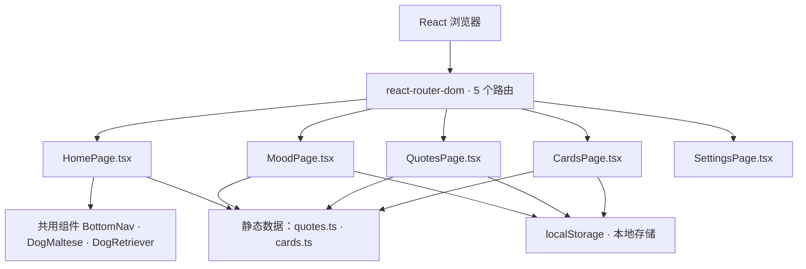

## 1. Architecture Design



## 2. Technology Description

- **Frontend**：React@18 + TypeScript@5 + Vite@5 + tailwindcss@3
- **Router**：react-router-dom@6
- **State & Storage**：localStorage（无需后端）
- **Styling**：Tailwind CSS + 自定义主题扩展（颜色 / 字体 / 动画关键帧）
- **Icons**：lucide-react 图标库
- **Icons & Illustrations**：纯 SVG 手绘风格插画组件（Maltese / Retriever）
- **Dev Tools**：Vite HMR 本地开发；`npm run build` 产出静态部署包
- **Browser Target**：现代浏览器（Chrome / Safari / Firefox / 手机浏览器）
- **没有后端**，没有 Supabase；所有数据写入浏览器 localStorage

## 3. Route Definitions
| Route | Purpose |
|-------|---------|
| / | Home: home page with dual dogs, daily mood, quote, quick entries |
| /mood | Mood recording + history timeline |
| /quotes | Quotes list, tab switch (Maltese / Retriever / All |
| /cards | Daily gacha card draw + collection progress |
| /settings | Data cleanup settings |

## 4. 无后端；本项目为纯前端应用

## 5. 无服务端架构（纯前端）

## 6. Data Model

### 6.1 前端存储结构

```ts
type MoodKey = 'happy' | 'normal' | 'tired' | 'anxious' | 'sad'

interface MoodRecord {
  date: string      // YYYY-MM-DD
  mood: MoodKey
  text: string
  createdAt: number
}

interface QuoteRecord {
  text: string
  dog: 'maltese' | 'retriever'
}

interface DogCard {
  id: string
  name: string
  description: string
  rarity: '普通' | '稀有' | '珍贵'
  emotion: 'happy' | 'sleep' | 'cheer' | 'hug' | 'daze'
  dog: 'maltese' | 'retriever'
  weight: number
}

interface DrawRecord {
  date: string
  cardId: string
}
```

localStorage keys：
- `linedog.moods`（JSON 数组，最近 60 条）
- `linedog.favQuotes`（收藏的语录文本数组）
- `linedog.collected`（已收集卡片 ID 数组）
- `linedog.draws`（抽卡记录数组，保留最近 120 条）
- `linedog.lastDrawDate`（上次抽卡日期，字符串或 null）

### 6.2 项目文件结构
```
/workspace
├── index.html
├── package.json
├── postcss.config.js
├── tailwind.config.js
├── tsconfig.json
├── vite.config.ts
└── src
    ├── App.tsx              # 路由配置
    ├── main.tsx             # 入口
    ├── index.css            # Tailwind + 全局样式
    ├── components
    │   ├── BottomNav.tsx   # 底部导航栏
    │   ├── DogMaltese.tsx  # 马尔济斯小狗插画
    │   └── DogRetriever.tsx # 小金毛小狗插画
    ├── pages
    │   ├── HomePage.tsx
    │   ├── MoodPage.tsx
    │   ├── QuotesPage.tsx
    │   ├── CardsPage.tsx
    │   └── SettingsPage.tsx
    ├── data
    │   ├── quotes.ts        # 双小狗语录
    │   └── cards.ts         # 5 张抽卡配置
    └── utils
        └── storage.ts          # localStorage helpers + todayStr + mood labels
```

